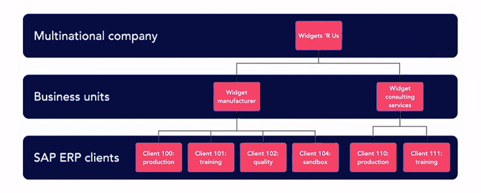

# SAP Implementation Process
1. Project preparation and business blueprinting
   1. Project cost
   2. Project scope
   3. Team
   4. Interfaces required
   5. Blueprinting (Requirement for the new system mapped)
2. Realization
   1. Configuration - SAP out-of-the-box functionality
   2. Customization - nopt default SAP functionality (Expensive and complicated)
3. Testing
   1. Unit Testing (Individual parts of the system)
   2. Integration testing 
   3. User acceptance testing (User experience)
   4. Performance testing 
4. Final preparation 
   1. Master data uploads
   2. User security roles
   3. End-user training
5. Go-Live
   1. Cutover activities
   2. Usage of the system in PRD
6. Post go-live support
   1. Production issues addressed
   2. Non-business critical customizations 

## Duration
5-6 months to 3-4 years

# SAP ERP Modules
Two types of modules:
* **Technical Modules**: Development and maintenance of functional applications
* **Functional Modules**: Transactions that align with business processes. 
 

## Functional modules
### Accounting modules
* SAP Financnial Accounting (FI)
* SAP Controlling (CO)
* SAP Project Systems (PS)

### Logistics Modules
* SAP Sales and Distribution (SD)
* SAP Materials Management (MM)
* SAP Production Planning (PP)
* SAP Quality Management (QM)
* SAP Plant Maintenance (PM)

### Human Resoruces Modukes
* SAP Human Capital Management (HCM)

## Industry modules
### Industry Solutions (IS)
* IS-A Automotive
* IS-U Utilities

### Financial Services (FS)
* FS-CM Claims Management
* FS-ICM Incentive / Commission Management 

# Master Data vs. Transactional Data
## Master Data
* All the information that deals with **people**, **places** or **objects**. 
* Foundation of data stored
* Mostly static
* Examples:
  * Business Partner records
  * Employee master data

## Transactional Data
* Actions
* Cosntantly changing
* Examples:
  * Purchase orders 
  * Sales orders
  * Changing work schedule 

# SAP Clients
* **Client**: Self-contained business unit. 
* We log in to an SAP Client specific 
* Different types 
  * Production: System of record of a business
  * Quality assurance: System devs
  * Sandbox: Experiment new changes 
  * Training: End-user training 

## Client Structure (Example)

# SAP Security Roles
* Every user mapped to a security role
* Allows or denies access to transaction in SAP
* Allows or denies access to organizational levels in SAP
  * Company code
  * Plant
  * Sales organization
